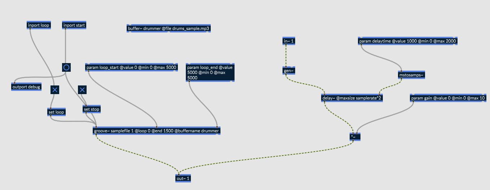
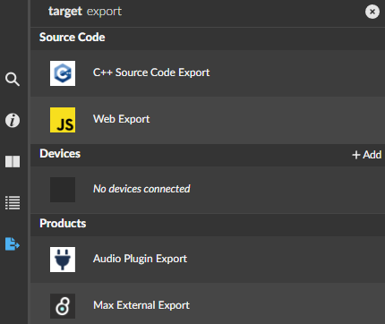
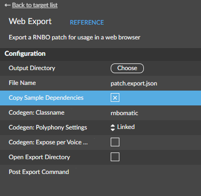
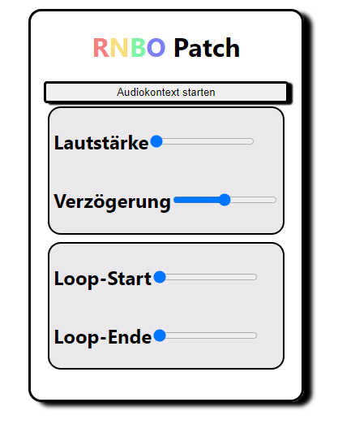

# Wie verwende ich dieses Template?

> [!NOTE]
> Um dieses Template vernünftig nutzen zu können werden Grundlagen der Webentwicklung im Allgemeinen sowie mit React.js vorrausgesetzt :neutral_face:
> Für einen einfachen Einstieg kann das offizielle Template genutzt werden:
> https://github.com/Cycling74/rnbo.example.webpage

## RNBO-Patch erstellen und exportieren

Erstelle in einem MAX-Patch das Objekt `rnbo~`. 
Durch einen Doppelklick auf dieses Objekt gelangst du in den RNBO-Patch.
Erstelle deinen Patch und nutze das `out~`-Objekt um ein Audiosignal aus dem Patch herauszuführen und das `in~`-Objekt um ein Audiosignal von Außen hereinzuleiten.
Mithilfe der `inport`- und `output`-Objekte können Nachrichten empfangen oder gesendet werden, um beispielsweise einen Bang auszulösen oder ein Toggle zu aktivieren/deaktivieren.

Der im Template voreingestellte RNBO-Patch sieht so aus:

Über das rechte Seitenmenü lässt sich der Patch für das Web als JSON-File exportieren.

Werden in dem Patch Audio-Files importiert, sollten sie über die Option 'Copy Sample Dependencies' direkt mit in den Zielordner exportiert werden.

> [!IMPORTANT]
> Es können MP3, WAV, M4A und AIFF Dateien in die Website eingebunden werden. Das AIFF-Format kann von Chrome nicht dekodiert werden

Die JSON-Datei muss in den export-Ordner des Templates. Die Samples müssen innerhalb dieses Ordners in das media-Verzeichnis exportiert werden.

## Webseite lokal hosten

Um das Projekt als Webseite lokal hosten zu können, muss Node.js sowie der Paketmanager NPM installiert sein. Wechsle nun in das Wuzelverzeichnis dieses Projekts.
Öffne hier die Konsole und installiere alle Abhängigkeiten für das Projekt mit dem Befehl `npm install`. 
Mit `npm start` wird die App gestartet. Der Browser sollte sich automatisch öffnen. Die Adresse lautet http://localhost:3000.

## Parameter auslesen und setzen

Ein Device gibt dir Zugriff auf seine Parameter über die .parameters-Eigenschaft, die ein Array von Parameter-Objekten zurückgibt.
Dieses Array kann ausgelesen und aktualisiert werden.
Jeder Parameter entspricht einem param-Objekt in rnbo~.

Dieses Template gibt standardmäßig alle Parameter, ihre IDs, Namen, aktuellen Werte sowie die Wertebereiche in der Browserkonsole aus.
Das erleichtert den Programmierungsprozess.

Die Werte der Parameter können einfach überschrieben werden:

`const param = device.parametersById.get("my_param");`
`param.value = 1;`

Hier wird der Wert des Parameters mit der ID "my_param" durch den Wert 1 aktualisiert. Woher die Werte kommen ist dabei
egal. Sie können zum Beispiel auch über eine API abgerufen werden.
Auch eine Erweiterung um eine grafische Oberfläche mithilfe von anderen Bibliotheken wie [three.js](https://threejs.org/), [ar.js](https://ar-js-org.github.io/AR.js-Docs/) oder [d3.js](https://d3js.org/) ist denkbar.

Weitere Informationen findest du hier: https://rnbo.cycling74.com/learn/getting-the-rnbojs-library

## Nachrichten senden und empfangen

Wie bereits erwähnt kannst du mit dem RNBO-Patch auch Nachrichten austauschen. In diesem Template wird das Sample über einen `Inport` abgespielt.

`const event = new MessageEvent(TimeNow, "start", [1]);`
`device.scheduleEvent(event);`

Hier wird die Nachricht '1' an den Inport mit dem Tag 'start'gesendet.

## Webapplikation veröffentlichen

Mit dem Befehl `npm run build` wird die App kompiliert und bereitgestellt. Der Inhalt des entstandenen build-Ordners kann ganz einfach gehostet werden.
